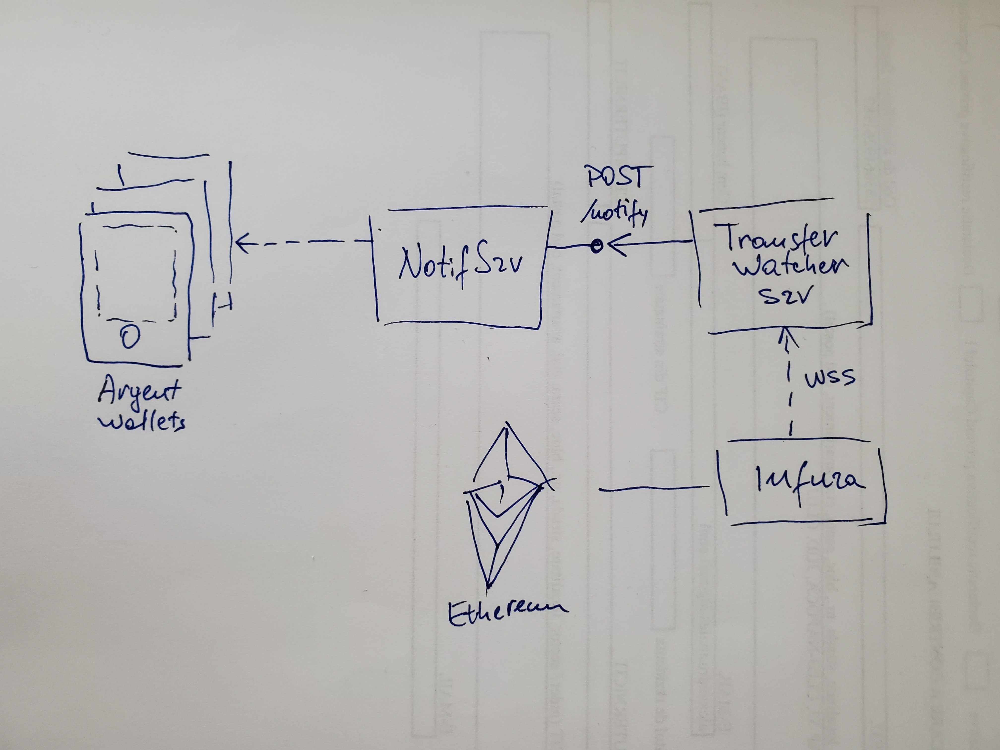

# Argent Assignment
Solution to interview [assessment](https://drive.google.com/file/d/1st0sCgcyF4TwqpbIH7mg9qchlaUyIm0P/view).

### Architecture
A new micro-service (`Transfer Watcher Service`) is created to watch for token transfers on Ethereum blockchain. 
Having configured a list of ERC20 contract addresses, each time a token is transferred to a given list of wallet addresses, the service makes a POST request to notify that the transfer has happened.



The service that implements the POST /notify endpoint (`Push Notification Service`) takes the transfer details (token name, amount, destination account address) and notifies Argent registered apps that they have received ERC20 tokens. As per assessment requirements, this service is already implemented and runs on Argent infrastructure.

##### Scalability
To make the token transfer notification feature scalable (as the number of wallet users grows), the following decisions have been made:
1. Push over polling. Instead for each device to regularly poll for new events and increase the load on Argent backend services each time new clients run the mobile apps, the `Transfer Watcher Service` runs a backend job that is registered to ETH Log flow and filters relevant events that it will post to the `Push Notification Service`.The `Push Notification Service` maintains the mapping between wallet addresses and connected Argent apps/devices. Once the `/notify` enpoint is called, it sends the notification through the corresponding web socket channel (or other push notification technology) and the user sees the notification on the screen.
2. ETH Log Events are filtered according to a preconfigured list of ERC20 contract addresses in order to send notifications related to tokens supported by Argent wallets only. 
3. (Possible improvement) To reduce the number of requests to '/notify' endpoint, it is possible to optimize based on number of apps that are running and have notifications enabled. For this, the `Transfer Watcher Service` will listen to a message queue each time an Argent app is activated and add it's wallet address to a filter. To be decided who sends the events (which Argent service) with addresses to be added to the filter when apps go online or to be removed when apps go offline.

##### Transfer Watcher Service
A spring boot application that connects to Ethereum via infura web sockets endpoint. How it works?
1. Connects to Ethereum via infura web sockets endpoint
2. Registers a ETH Log flowable to get events for a list of ERC20 contract addresses.
3. When a transfer event is received, the destination wallet address, the transferred amount and the transaction hash are retrieved.
4. To retrieve the token name and compute the amount in human readable form, makes a call to ERC20 smart contract to get the token name (+ symbol) and the number of decimals.
5. Makes an HTTP POST request to /notify to pass the data required by the assessment: wallet address, token value and token name.

### How to run the prototype

1. Package

```
mvn clean package
```

2. (Optional) Overwrite the list of watched ERC20 contract addresses in a new file called `application.yaml` 

```
watcher:
  addresses:
    - 0x7E0480Ca9fD50EB7A3855Cf53c347A1b4d6A2FF5 
    - 0xF6fF95D53E08c9660dC7820fD5A775484f77183A 
    - 0x101848D5C5bBca18E6b4431eEdF6B95E9ADF82FA 
```
Put the file into the root execution dir.

3. Run 

```
java -jar target/transfer-watcher-0.0.1-SNAPSHOT.jar
```

4. Make a transfer of a token associated with one of the contract addresses (above) on ropsten Ethereum network. 

5. Verify that the `POST /notify` request has been executed.
Open [https://requestbin.fullcontact.com/xl33nwxl?inspect](https://requestbin.fullcontact.com/xl33nwxl?inspect). Here you will see the POST request notifications containing the token names, amounts and destination addresses as a proof that this service is working.


### Next steps:
* Implement a rest endpoint or JMS event listener to dynamically change the list of ERC20 addresses that are being watched. That would also avoid the need to restart the service when the list of supported ERC20 tokens is changed.
* Reconnect when Websocket connections are lost.
* Error handling